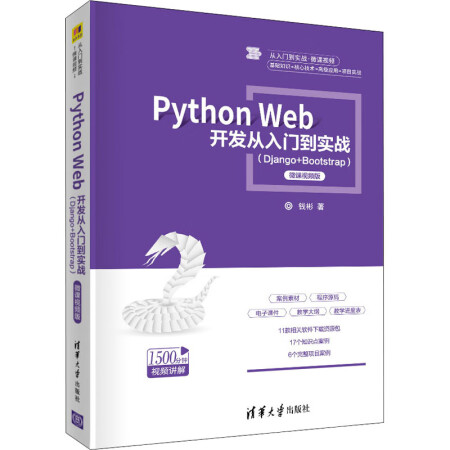

# 《Python Web开发从入门到实战（Django+Bootstrap）》

  

## 🔥 最新动态

- 🔥**2025.5.1**🔥：第二版上架
  - **💙 个人购买链接🔗：** 京东、淘宝、当当
  - **👩‍🏫 学校教材批量购买链接🔗：** 清华出版社

## ⭐ 配套资源（代码）

* **第1章** Python Web环境搭建：
[资源链接](https://aistudio.baidu.com/datasetdetail/253430)

* **第2章** 基础语法：
[资源链接](https://aistudio.baidu.com/datasetdetail/252154)

* **第3章** 企业门户网站框架设计：
[资源链接](https://aistudio.baidu.com/datasetdetail/251514)

* **第4章** 开发“科研基地”模块：
[资源链接](https://aistudio.baidu.com/datasetdetail/103078)

* **第5章** 开发“公司简介”模块：
[资源链接](https://aistudio.baidu.com/datasetdetail/253252)

* **第6章** 开发“产品中心”模块：
[资源链接](https://aistudio.baidu.com/datasetdetail/240620)

* **第7章** 开发“新闻动态”模块：
[资源链接](https://aistudio.baidu.com/datasetdetail/237276)

* **第8章** 开发“人才招聘”模块：
[资源链接](https://aistudio.baidu.com/datasetdetail/244532)

* **第9章** 开发“服务支持”模块：
[资源链接](https://aistudio.baidu.com/datasetdetail/244532)

* **第10章** 开发“首页”模块：
[资源链接](https://aistudio.baidu.com/datasetdetail/244532)

* **第11章** 基于Windows的项目部署：
[资源链接](https://aistudio.baidu.com/datasetdetail/244532)

* **第12章** 深入浅出Django：
[资源链接](https://aistudio.baidu.com/datasetdetail/244532)

## 🧙‍♂️ 欢迎交流
* **书籍相关技术问题探讨**：
扫描二维码加入本书QQ群**820106877**，获得更高效的问题答疑，与各行业开发者交流讨论，期待您的加入！

  

* **项目合作**：

  

